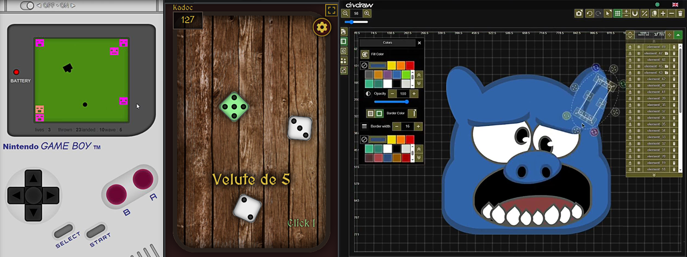
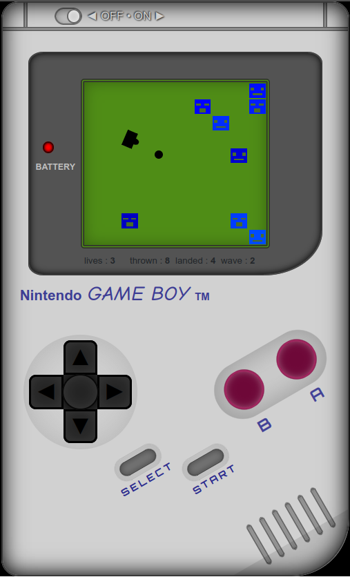
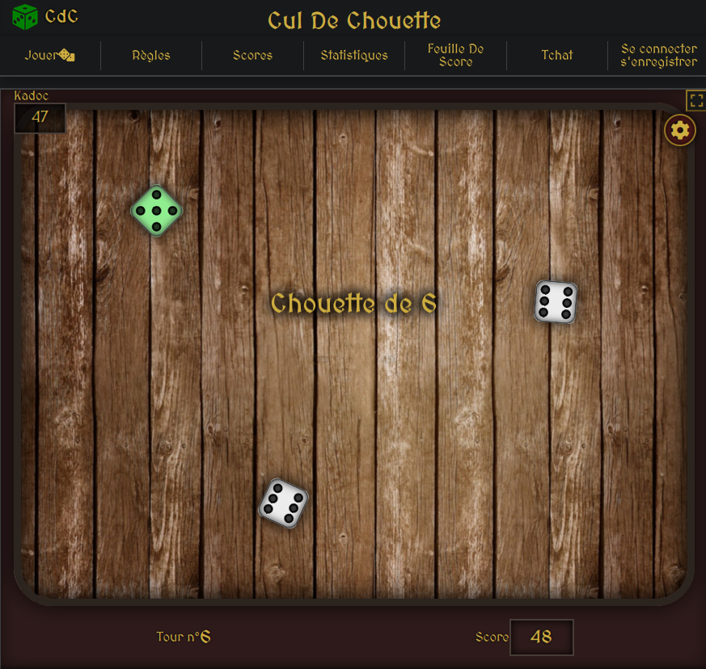
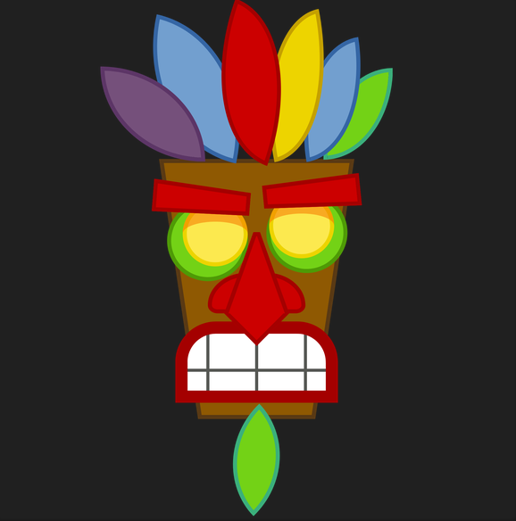

## Développeur Fullstack
*Du besoin flou à l'application livrée clé en main*

*A propos :*
*Ancien Concepteur/développeur de produits industriels en bureau d'études orienté éco-conception :bulb:, ancien musicien professionnel :guitar:, développeur web fullstack depuis 5 ans en environnement d'entreprise.
L'essentiel de mon travail vit dans des codebases privées/clients, comme pour la plupart des devs pro. Mon parcours et mes réalisations professionnelles :*
- *[profil **LinkedIn**](https://www.linkedin.com/in/patrice-mulot-844a4721b/)*.
<!-- - *[TODO][lien CV] : héberger quelque part sur ma machine distante un lien vers le pdf généré, voir faire un dépot juste pour ça ? réfléchir à un moyen de l'update et le rendre dispo directement et facilement[/TODO]*. -->

***Ici**, vous trouverez quelques projets personnels dont mes tout premiers, assumés tels quels."*

# QUELQUES PROJETS
*Mes projets personnels, point de départ de mon parcours dev :*

*voir les projets : https://github.com/pat-mulot?tab=repositories*

## Space Pat-Vaders
> Projet réalisé "jour 1" en sortie de formation (2021), expérimentation et premier projet frontend.

*Jeu de tir façon Space Invaders dans une interface fidèle à une Gameboy, jouable au clavier, à la souris ou écran tactile, vagues d'ennemis à difficulté croissante.*

*Intérêt technique : algorithmique de trajectoires et détection de collisions en JS pur, gestion unifiée de trois modes d'entrée (clavier/souris/tactile), interface responsive pensée pour occuper tout l'écran en mobile.*

principaux langages/techno utilisés : Javascript Vanilla

- Repo git : https://github.com/pat-mulot/space-patvaders
- Application live : https://pat-mulot.com/games/space-patvaders/
- Vidéo de démo : https://www.youtube.com/watch?v=3elcRETYWRM
  
***Penser a activer le bouton "ON" de la gameboy pour lancer le jeu***

|Aperçu|
|---|
||

## CUL DE CHOUETTE
> Projet réalisé "jour 2" en sortie de formation (2021) — première application web complète (frontend + backend, contenu administrable).

*Application complète autour du jeu de dés "cul de chouette" (règles communautaires du jeu évoqué dans la série Kaamelott) : accueil et articles administrables, page des règles, comptes joueurs, classement façon borne d'arcade et statistiques par joueur — et le jeu lui-même : lancers en deux temps, détection automatique des figures, mode entraînement ou adversaires scriptés.*

*Intérêt technique : première app fullstack — gestion de contenu administrable (WordPress), comptes et données persistantes (scores, statistiques) ; côté jeu, adversaires aux comportements scriptés différenciés (vitesse, prise de risque, aléa) et détection de figures/scoring complet en JS.*

principaux langages/techno utilisés : Javascript Vanilla, WordPress/PHP

- Repo git : https://github.com/pat-mulot/wpcdc
- Application live : https://pat-mulot.com/games/wpcdc/public/game/
- Vidéo de démo : https://www.youtube.com/watch?v=YL4Xv0PTakg

|Aperçu||
|---|---|
|||

## DivDraw
> Dernier grand projet front avant de me consacrer à mon framework Laravel actuel, expérimentation frontend plus avancée.

*Outil de dessin façon DAO dans le navigateur : ajouter des formes, les redimensionner/pivoter/colorer, les grouper ou fusionner en SVG, grille magnétique, undo/redo, export PNG/SVG.*

*Intérêt technique : la vraie difficulté était la trigonométrie du redimensionnement sous rotation, zoom et grille magnétique combinés, et la gestion de groupes d'éléments fusionnables en une seule forme SVG.*

principaux langages/techno utilisés : Vue.js, SASS

- Repo git : https://github.com/pat-mulot/divdraw
- Application live : https://pat-mulot.com/games/divdraw/#/en/
- Vidéo de démo : https://www.youtube.com/watch?v=54F96AuAHUM

|Aperçu||
|---|---|
|||

---

me contacter :
```
pat.mulot.pro@gmail.com
```  
